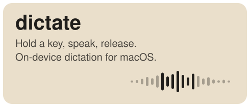
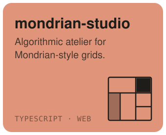
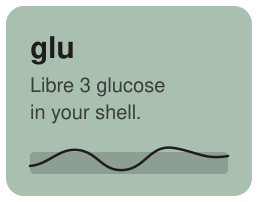
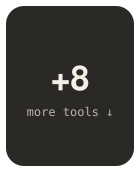
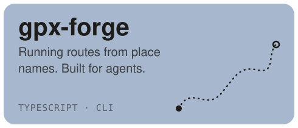

<picture>
  <source media="(prefers-color-scheme: dark)" srcset="https://readme-typing-svg.demolab.com?font=JetBrains+Mono&weight=500&size=28&duration=2200&pause=999999&color=F4EFE4&width=320&height=50&repeat=false&lines=Hi%2C+I'm+Serhii" />
  
</picture>

*I make the things I wished existed, with as much care as I can give them.*

<!-- grid:start -->

 

### More tools

<table>
<tr>
<td width="50%">&nbsp;<a href="https://github.com/serhiitroinin/strap"><b>strap</b></a> &nbsp;WHOOP recovery, strain and sleep.</td>
<td width="50%">&nbsp;<a href="https://github.com/serhiitroinin/cadence"><b>cadence</b></a> &nbsp;Garmin readiness, HRV and activities.</td>
</tr>
<tr>
<td width="50%">&nbsp;<a href="https://github.com/serhiitroinin/rescuetime"><b>rescuetime</b></a> &nbsp;Productivity pulse and focus time.</td>
<td width="50%">&nbsp;<a href="https://github.com/serhiitroinin/tick"><b>tick</b></a> &nbsp;Todoist tasks, projects and labels.</td>
</tr>
<tr>
<td width="50%">&nbsp;<a href="https://github.com/serhiitroinin/pigeon"><b>pigeon</b></a> &nbsp;Gmail and Fastmail, multi-account.</td>
<td width="50%">&nbsp;<a href="https://github.com/serhiitroinin/almanac"><b>almanac</b></a> &nbsp;Google Calendar agenda and scheduling.</td>
</tr>
<tr>
<td width="50%">&nbsp;<a href="https://github.com/serhiitroinin/dnsimple-cli"><b>dnsimple-cli</b></a> &nbsp;Domains, DNS records and certificates.</td>
<td width="50%">&nbsp;<a href="https://github.com/serhiitroinin/hostler"><b>hostler</b></a> &nbsp;Local dev domains with nginx.</td>
</tr>
</table>
<!-- grid:end -->

---

[X](https://x.com/serhiitroinin) &nbsp;·&nbsp; [email](mailto:serhiitroinin@fastmail.com) &nbsp;·&nbsp; [LinkedIn](https://www.linkedin.com/in/serhii-troinin-a0b718127/)
