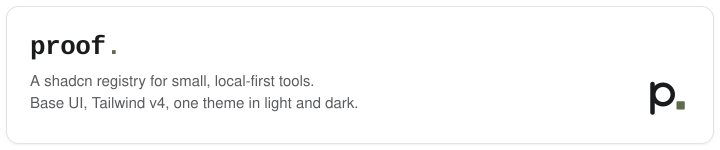

<!-- header:start -->
<a href="https://github.com/serhiitroinin/"><picture><source media="(prefers-color-scheme: dark)" srcset="assets/header-dark.svg"></picture></a>
<!-- header:end -->

I make the things I wished existed, with as much care as I can give them.

<!-- grid:start -->

<a href="https://github.com/serhiitroinin/reins"><picture><source media="(prefers-color-scheme: dark)" srcset="assets/card-reins-dark.svg"></picture></a><a href="https://github.com/serhiitroinin/dictate"><picture><source media="(prefers-color-scheme: dark)" srcset="assets/card-dictate-dark.svg"></picture></a><a href="https://github.com/serhiitroinin/proof"><picture><source media="(prefers-color-scheme: dark)" srcset="assets/card-proof-dark.svg"></picture></a>

### More tools

<a href="https://github.com/serhiitroinin/butler"><picture><source media="(prefers-color-scheme: dark)" srcset="assets/icon-butler-dark.svg"></picture></a>&nbsp; <a href="https://github.com/serhiitroinin/butler">butler</a> A folder organised by an agent. You approve every move. 
<a href="https://github.com/serhiitroinin/easel"><picture><source media="(prefers-color-scheme: dark)" srcset="assets/icon-easel-dark.svg"></picture></a>&nbsp; <a href="https://github.com/serhiitroinin/easel">easel</a> One whiteboard, two hands: yours and the agent's. 
<a href="https://github.com/serhiitroinin/sculpt"><picture><source media="(prefers-color-scheme: dark)" srcset="assets/icon-sculpt-dark.svg"></picture></a>&nbsp; <a href="https://github.com/serhiitroinin/sculpt">sculpt</a> CAD with an agent. Real solids, exported to STEP and STL. 
<a href="https://github.com/serhiitroinin/mondrian-studio"><picture><source media="(prefers-color-scheme: dark)" srcset="assets/icon-mondrian-studio-dark.svg"></picture></a>&nbsp; <a href="https://github.com/serhiitroinin/mondrian-studio">mondrian-studio</a> Algorithmic atelier for Mondrian-style grids. 
<a href="https://github.com/serhiitroinin/gpx-forge"><picture><source media="(prefers-color-scheme: dark)" srcset="assets/icon-gpx-forge-dark.svg"></picture></a>&nbsp; <a href="https://github.com/serhiitroinin/gpx-forge">gpx-forge</a> Running routes from place names. Built for agents. 
<a href="https://github.com/serhiitroinin/glu"><picture><source media="(prefers-color-scheme: dark)" srcset="assets/icon-glu-dark.svg"></picture></a>&nbsp; <a href="https://github.com/serhiitroinin/glu">glu</a> FreeStyle Libre 3 glucose in your shell. 
<a href="https://github.com/serhiitroinin/strap"><picture><source media="(prefers-color-scheme: dark)" srcset="assets/icon-strap-dark.svg"></picture></a>&nbsp; <a href="https://github.com/serhiitroinin/strap">strap</a> WHOOP recovery, strain and sleep. 
<a href="https://github.com/serhiitroinin/cadence"><picture><source media="(prefers-color-scheme: dark)" srcset="assets/icon-cadence-dark.svg"></picture></a>&nbsp; <a href="https://github.com/serhiitroinin/cadence">cadence</a> Garmin readiness, HRV and activities. 
<a href="https://github.com/serhiitroinin/rescuetime"><picture><source media="(prefers-color-scheme: dark)" srcset="assets/icon-rescuetime-dark.svg"></picture></a>&nbsp; <a href="https://github.com/serhiitroinin/rescuetime">rescuetime</a> Productivity pulse and focus time. 
<a href="https://github.com/serhiitroinin/tick"><picture><source media="(prefers-color-scheme: dark)" srcset="assets/icon-tick-dark.svg"></picture></a>&nbsp; <a href="https://github.com/serhiitroinin/tick">tick</a> Todoist tasks, projects and labels. 
<a href="https://github.com/serhiitroinin/pigeon"><picture><source media="(prefers-color-scheme: dark)" srcset="assets/icon-pigeon-dark.svg"></picture></a>&nbsp; <a href="https://github.com/serhiitroinin/pigeon">pigeon</a> Gmail and Fastmail, multi-account. 
<a href="https://github.com/serhiitroinin/almanac"><picture><source media="(prefers-color-scheme: dark)" srcset="assets/icon-almanac-dark.svg"></picture></a>&nbsp; <a href="https://github.com/serhiitroinin/almanac">almanac</a> Google Calendar agenda and scheduling. 
<a href="https://github.com/serhiitroinin/dnsimple-cli"><picture><source media="(prefers-color-scheme: dark)" srcset="assets/icon-dnsimple-cli-dark.svg"></picture></a>&nbsp; <a href="https://github.com/serhiitroinin/dnsimple-cli">dnsimple-cli</a> Domains, DNS records and certificates. 
<a href="https://github.com/serhiitroinin/hostler"><picture><source media="(prefers-color-scheme: dark)" srcset="assets/icon-hostler-dark.svg"></picture></a>&nbsp; <a href="https://github.com/serhiitroinin/hostler">hostler</a> Local dev domains with nginx. 

<!-- grid:end -->

---

[X](https://x.com/serhiitroinin) &nbsp;·&nbsp; [email](mailto:serhiitroinin@fastmail.com) &nbsp;·&nbsp; [LinkedIn](https://www.linkedin.com/in/serhii-troinin-a0b718127/)
