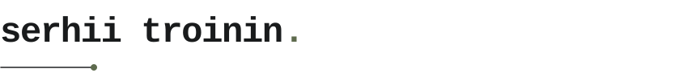
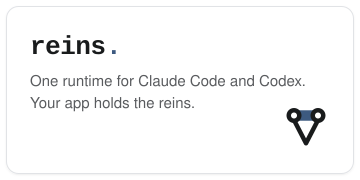
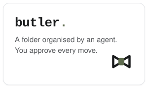
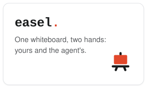
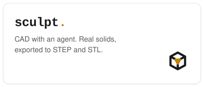
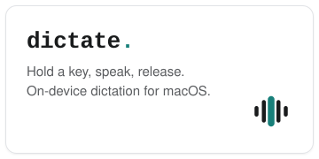
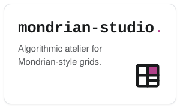
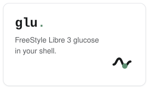
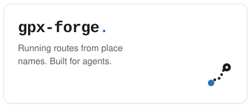

<!-- header:start -->
<a href="https://github.com/serhiitroinin/"><picture><source media="(prefers-color-scheme: dark)" srcset="assets/header-dark.svg"></picture></a>
<!-- header:end -->

I make the things I wished existed, with as much care as I can give them.

<!-- grid:start -->

<a href="https://github.com/serhiitroinin/reins"><picture><source media="(prefers-color-scheme: dark)" srcset="assets/card-reins-dark.svg"></picture></a><a href="https://github.com/serhiitroinin/butler"><picture><source media="(prefers-color-scheme: dark)" srcset="assets/card-butler-dark.svg"></picture></a><a href="https://github.com/serhiitroinin/easel"><picture><source media="(prefers-color-scheme: dark)" srcset="assets/card-easel-dark.svg"></picture></a><a href="https://github.com/serhiitroinin/sculpt"><picture><source media="(prefers-color-scheme: dark)" srcset="assets/card-sculpt-dark.svg"></picture></a><a href="https://github.com/serhiitroinin/dictate"><picture><source media="(prefers-color-scheme: dark)" srcset="assets/card-dictate-dark.svg"></picture></a><a href="https://github.com/serhiitroinin/mondrian-studio"><picture><source media="(prefers-color-scheme: dark)" srcset="assets/card-mondrian-studio-dark.svg"></picture></a><a href="https://github.com/serhiitroinin/glu"><picture><source media="(prefers-color-scheme: dark)" srcset="assets/card-glu-dark.svg"></picture></a><a href="https://github.com/serhiitroinin/gpx-forge"><picture><source media="(prefers-color-scheme: dark)" srcset="assets/card-gpx-forge-dark.svg"></picture></a>

### More tools

<table>
<tr>
<td><a href="https://github.com/serhiitroinin/strap"><picture><source media="(prefers-color-scheme: dark)" srcset="assets/icon-strap-dark.svg"></picture></a>&nbsp; <a href="https://github.com/serhiitroinin/strap"><code>strap</code></a> WHOOP recovery, strain and sleep.</td>
<td><a href="https://github.com/serhiitroinin/cadence"><picture><source media="(prefers-color-scheme: dark)" srcset="assets/icon-cadence-dark.svg"></picture></a>&nbsp; <a href="https://github.com/serhiitroinin/cadence"><code>cadence</code></a> Garmin readiness, HRV and activities.</td>
</tr>
<tr>
<td><a href="https://github.com/serhiitroinin/rescuetime"><picture><source media="(prefers-color-scheme: dark)" srcset="assets/icon-rescuetime-dark.svg"></picture></a>&nbsp; <a href="https://github.com/serhiitroinin/rescuetime"><code>rescuetime</code></a> Productivity pulse and focus time.</td>
<td><a href="https://github.com/serhiitroinin/tick"><picture><source media="(prefers-color-scheme: dark)" srcset="assets/icon-tick-dark.svg"></picture></a>&nbsp; <a href="https://github.com/serhiitroinin/tick"><code>tick</code></a> Todoist tasks, projects and labels.</td>
</tr>
<tr>
<td><a href="https://github.com/serhiitroinin/pigeon"><picture><source media="(prefers-color-scheme: dark)" srcset="assets/icon-pigeon-dark.svg"></picture></a>&nbsp; <a href="https://github.com/serhiitroinin/pigeon"><code>pigeon</code></a> Gmail and Fastmail, multi-account.</td>
<td><a href="https://github.com/serhiitroinin/almanac"><picture><source media="(prefers-color-scheme: dark)" srcset="assets/icon-almanac-dark.svg"></picture></a>&nbsp; <a href="https://github.com/serhiitroinin/almanac"><code>almanac</code></a> Google Calendar agenda and scheduling.</td>
</tr>
<tr>
<td><a href="https://github.com/serhiitroinin/dnsimple-cli"><picture><source media="(prefers-color-scheme: dark)" srcset="assets/icon-dnsimple-cli-dark.svg"></picture></a>&nbsp; <a href="https://github.com/serhiitroinin/dnsimple-cli"><code>dnsimple-cli</code></a> Domains, DNS records and certificates.</td>
<td><a href="https://github.com/serhiitroinin/hostler"><picture><source media="(prefers-color-scheme: dark)" srcset="assets/icon-hostler-dark.svg"></picture></a>&nbsp; <a href="https://github.com/serhiitroinin/hostler"><code>hostler</code></a> Local dev domains with nginx.</td>
</tr>
</table>
<!-- grid:end -->

---

[X](https://x.com/serhiitroinin) &nbsp;·&nbsp; [email](mailto:serhiitroinin@fastmail.com) &nbsp;·&nbsp; [LinkedIn](https://www.linkedin.com/in/serhii-troinin-a0b718127/)
